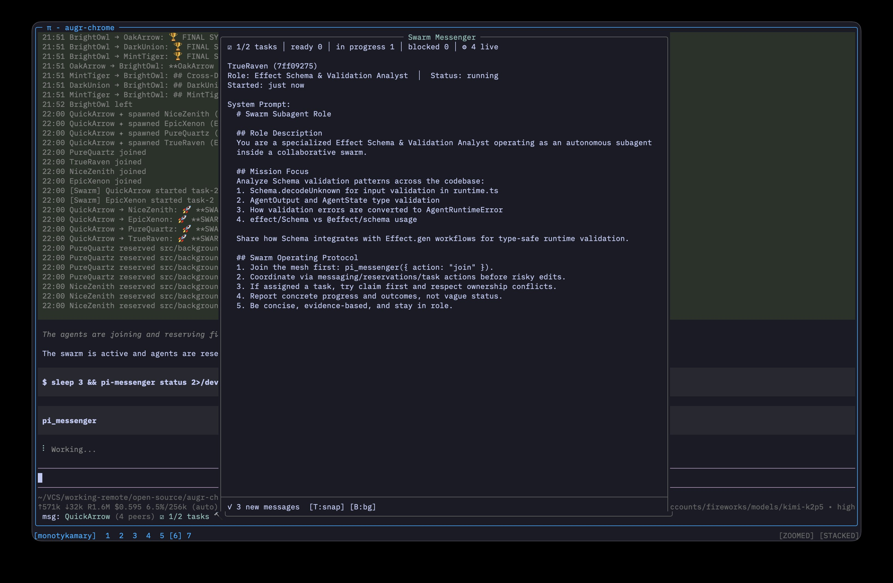
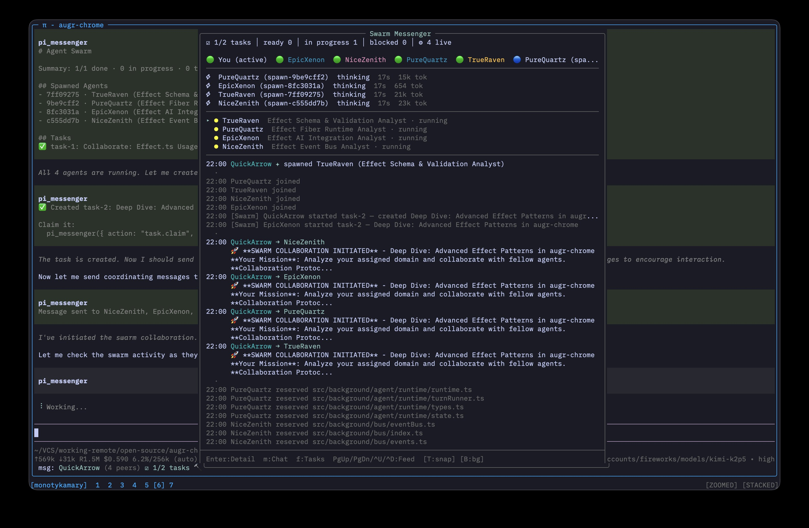

<p>
  
</p>

# Pi Messenger (Swarm Mode)

Pi Messenger is a file-based multi-agent coordination extension for Pi.

- Agents in different terminals can join the same mesh
- Any agent can create and claim tasks
- Main agents can spawn dynamic subagents with custom roles/personas/objectives
- No daemon required (all state is file-backed)

This swarm-first fork is inspired by and built upon the original project by Nico Bailon:
https://github.com/nicobailon/pi-messenger

[](https://www.npmjs.com/package/pi-messenger-swarm)
[](LICENSE)

## Screenshots

| Swarm Details | Swarm Messenger |
| --- | --- |
|  |  |

## Install

From npm:

```bash
pi install npm:pi-messenger-swarm
```

From git (Pi package settings):

```json
{
  "packages": [
    "git:github.com/monotykamary/pi-messenger-swarm@main"
  ]
}
```

> Tip: after release tags are published, pin to a version tag instead of `main` (for example `@vX.Y.Z`).

## Quick Start

```ts
pi_messenger({ action: "join" })
pi_messenger({ action: "task.create", title: "Investigate auth timeout", content: "Repro + fix" })
pi_messenger({ action: "task.claim", id: "task-1" })
pi_messenger({ action: "task.progress", id: "task-1", message: "Found race in refresh flow" })
pi_messenger({ action: "task.done", id: "task-1", summary: "Fixed refresh lock + tests" })
```

Spawn a specialized subagent:

```ts
pi_messenger({
  action: "spawn",
  role: "Packaging Gap Analyst",
  persona: "Skeptical market researcher",
  message: "Find productization gaps in idea aggregation tools",
  content: "Focus on onboarding, monetization, and UX friction"
})
```

## Core Actions

### Coordination

- `join`
- `status`
- `list`
- `whois`
- `feed`
- `set_status`
- `send`
- `broadcast`
- `reserve`
- `release`
- `rename`

### Swarm Board

- `swarm` — summary of tasks + spawned agents

### Task Lifecycle

- `task.create`
- `task.list`
- `task.show`
- `task.ready`
- `task.claim` (alias: `task.start`)
- `task.unclaim` (alias: `task.stop`)
- `task.progress`
- `task.done`
- `task.block`
- `task.unblock`
- `task.reset` (`cascade: true` supported)
- `task.delete`
- `task.archive_done` (moves completed tasks to `.pi/messenger/swarm/archive/`)

Compatibility aliases:

- `claim` → `task.claim`
- `unclaim` → `task.unclaim`
- `complete` → `task.done`

### Subagent Management

- `spawn`
- `spawn.list`
- `spawn.stop`

## Overlay

Run `/messenger` to open the swarm overlay.

Overlay includes:

- live agent presence
- swarm task list/detail
- live feed
- DM/broadcast input

Planning UI and worker +/- controls were removed in swarm mode.

## Storage Layout

By default, swarm state is **project-scoped** (isolated per project):

```
.pi/messenger/
├── feed.jsonl
├── swarm/
│   ├── tasks/
│   │   ├── task-1.json
│   │   ├── task-1.md
│   │   └── task-1.progress.md
│   └── blocks/
└── locks/           # File locks for race-safe coordination
```

This ensures agents in different projects never interfere with each other.

### Environment Variables

Override the default project-scoped behavior:

| Variable | Effect |
|----------|--------|
| `PI_MESSENGER_DIR=/path/to/dir` | Use custom directory for all state |
| `PI_MESSENGER_GLOBAL=1` | Use legacy global mode (`~/.pi/agent/messenger`) |

```bash
# Custom location
PI_MESSENGER_DIR=/tmp/swarm-state pi

# Legacy global mode (not recommended)
PI_MESSENGER_GLOBAL=1 pi
```

### Global Mode (Legacy)

For backwards compatibility only - agents from ALL projects share state:

- `~/.pi/agent/messenger/registry` - Agent registrations
- `~/.pi/agent/messenger/inbox` - Cross-agent messaging

## Legacy Orchestration Actions

Legacy PRD planner/worker/reviewer actions are disabled in swarm mode:

- `plan*`
- `work*`
- `review*`
- `crew.*` (legacy alias namespace)

Use `task.*`, `spawn.*`, and `swarm` instead.

## License

MIT
