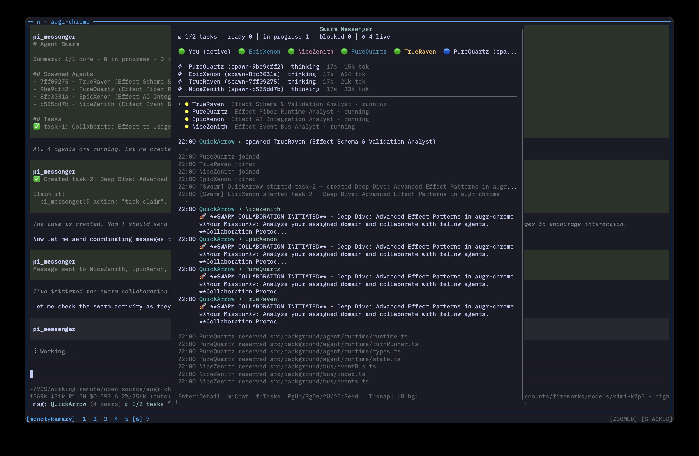
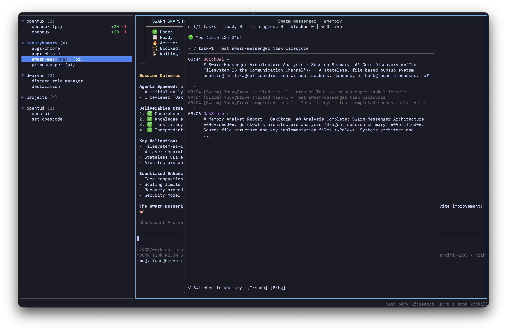
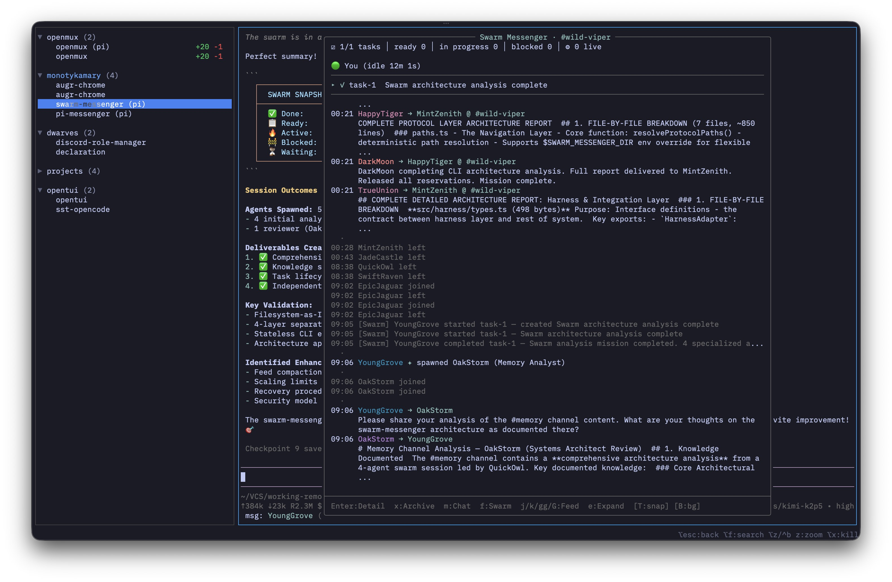

<p>
  
</p>

# Pi Messenger (Swarm Mode)

Pi Messenger is a file-based multi-agent coordination extension for Pi.

- Agents in different terminals can join the same mesh
- Each Pi session gets its own default session channel
- Named channels like `#memory` and `#heartbeat` remain durable shared spaces
- Feed events, tasks, archives, and message routing are channel-scoped
- Main agents can spawn dynamic subagents with custom roles/personas/objectives
- No daemon required (all state is file-backed)

This swarm-first fork is inspired by and built upon the original project by Nico Bailon:
https://github.com/nicobailon/pi-messenger

[](https://www.npmjs.com/package/pi-messenger-swarm)
[](LICENSE)

## Screenshots

| Swarm Details | Swarm Messenger |
| --- | --- |
|  |  |
| Memory Channel | Session Channel |
|  |  |

## Install

From npm:

```bash
pi install npm:pi-messenger-swarm
```

From git (Pi package settings):

```json
{
  "packages": [
    "git:github.com/monotykamary/pi-messenger-swarm@main"
  ]
}
```

> Tip: after release tags are published, pin to a version tag instead of `main` (for example `@vX.Y.Z`).

## Quick Start

Join the messenger and start collaborating in your session channel:

```ts
pi_messenger({ action: "join" })
pi_messenger({ action: "send", to: "#memory", message: "Investigating auth timeout in refresh flow" })
pi_messenger({ action: "task.create", title: "Investigate auth timeout", content: "Repro + fix" })
pi_messenger({ action: "task.claim", id: "task-1" })
pi_messenger({ action: "task.progress", id: "task-1", message: "Found race in refresh flow" })
pi_messenger({ action: "task.done", id: "task-1", summary: "Fixed refresh lock + tests" })
```

Spawn a specialized subagent:

```ts
pi_messenger({
  action: "spawn",
  role: "Packaging Gap Analyst",
  persona: "Skeptical market researcher",
  message: "Find productization gaps in idea aggregation tools",
  content: "Focus on onboarding, monetization, and UX friction"
})
```

## Channel Model

Pi Messenger is now **channel-first**.

### Session channels

Each Pi session gets a dedicated default channel, generated as a human-friendly phrase such as:

- `#quiet-river`
- `#wild-viper`
- `#ember-owl`

The same Pi `sessionId` restores the same session channel when reopened.

### Named channels

Two durable named channels are created by default:

- `#memory` — cross-session knowledge, notes, decisions, and async handoff
- `#heartbeat` — long-running status, reports, and heartbeat-style updates

You can also create additional named channels explicitly with `join`.

### Durable channel posting

Channel messages are durable even when nobody is listening.

Posting to a channel means:

1. append to that channel's feed
2. try live inbox delivery to agents currently joined to that channel

That makes channels useful as async coordination logs for later agents to pick up.

### Session switching and resume

If Pi switches or resumes sessions inside the same live messenger instance, messenger rebinds to the resumed Pi session:

- restores the correct session channel
- drops stale old session-channel membership
- restarts watchers on the correct inbox
- keeps named channels like `#memory` and `#heartbeat`

## Core Actions

### Coordination

- `join`
- `status`
- `list`
- `whois`
- `feed`
- `set_status`
- `send`
- `reserve`
- `release`
- `rename`

### Swarm Board

- `swarm` — summary of tasks + spawned agents

### Task Lifecycle

- `task.create`
- `task.list`
- `task.show`
- `task.ready`
- `task.claim` (alias: `task.start`)
- `task.unclaim` (alias: `task.stop`)
- `task.progress`
- `task.done`
- `task.block`
- `task.unblock`
- `task.reset` (`cascade: true` supported)
- `task.delete`
- `task.archive_done` (moves completed tasks to `.pi/messenger/archive/<channel>/...`)

Compatibility aliases:

- `claim` → `task.claim`
- `unclaim` → `task.unclaim`
- `complete` → `task.done`

### Subagent Management

- `spawn`
- `spawn.list`
- `spawn.stop`

## Messaging Semantics

`send` now always requires an explicit `to:` target.

### Direct message an agent

```ts
pi_messenger({ action: "send", to: "OtherAgent", message: "Need your API shape before I commit" })
```

### Post durably to a channel

```ts
pi_messenger({ action: "send", to: "#memory", message: "Claimed task-4, touching src/auth/session.ts" })
pi_messenger({ action: "send", to: "#heartbeat", message: "Nightly sync complete" })
```

### Switch channels explicitly

```ts
pi_messenger({ action: "join", channel: "memory" })
pi_messenger({ action: "join", channel: "architecture", create: true })
```

### Read a channel feed

```ts
pi_messenger({ action: "feed", limit: 20 })
pi_messenger({ action: "feed", channel: "memory", limit: 20 })
```

### Notes

- `to: "#channel"` is the canonical way to post to a channel
- `send` without `to` is invalid
- the old `broadcast` action is removed
- for channel posts, prefer `to: "#channel"` over `channel: "..."`

## Overlay

Run `/messenger` to open the swarm overlay.

Overlay includes:

- live agent presence
- swarm task list/detail
- live feed for the current channel
- DM/current-channel post input
- channel switching

Message input behavior:

- `@name <message>` sends a DM
- plain text posts to the current channel

Planning UI and worker +/- controls were removed in swarm mode.

## Storage Layout

By default, swarm state is **project-scoped** (isolated per project):

```text
.pi/messenger/
├── channels/
│   ├── memory.json
│   ├── heartbeat.json
│   └── quiet-river.json
├── feed/
│   ├── memory.jsonl
│   ├── heartbeat.jsonl
│   └── quiet-river.jsonl
├── tasks/
│   ├── memory/
│   │   ├── task-1.json
│   │   ├── task-1.md
│   │   ├── task-1.progress.md
│   │   └── blocks/
│   └── quiet-river/
├── archive/
│   ├── memory/
│   └── quiet-river/
├── registry/
├── inbox/
└── swarm/
    └── locks/
```

This ensures agents in different projects never interfere with each other, while still isolating work further by channel inside a project.

## Breaking Changes

This design intentionally breaks older messaging assumptions.

- `broadcast` action was removed
- `send` without `to` was removed
- feed history is now stored per channel at `.pi/messenger/feed/<channel>.jsonl`
- tasks are now stored per channel at `.pi/messenger/tasks/<channel>/...`
- archives are now stored per channel at `.pi/messenger/archive/<channel>/...`
- session channels are phrase-based instead of `session-*` timestamp-like ids

Use these patterns instead:

```ts
pi_messenger({ action: "send", to: "AgentName", message: "..." })
pi_messenger({ action: "send", to: "#channel", message: "..." })
```

## Environment Variables

Override the default project-scoped behavior:

| Variable | Effect |
|----------|--------|
| `PI_MESSENGER_DIR=/path/to/dir` | Use custom directory for all state |
| `PI_MESSENGER_GLOBAL=1` | Use legacy global mode (`~/.pi/agent/messenger`) |

```bash
# Custom location
PI_MESSENGER_DIR=/tmp/swarm-state pi

# Legacy global mode (not recommended)
PI_MESSENGER_GLOBAL=1 pi
```

### Global Mode (Legacy)

For backwards compatibility only - agents from ALL projects share state:

- `~/.pi/agent/messenger/registry` - Agent registrations
- `~/.pi/agent/messenger/inbox` - Cross-agent messaging

## Legacy Orchestration Actions

Legacy PRD planner/worker/reviewer actions are disabled in swarm mode:

- `plan*`
- `work*`
- `review*`
- `crew.*` (legacy alias namespace)

Use `task.*`, `spawn.*`, and `swarm` instead.

## License

MIT
